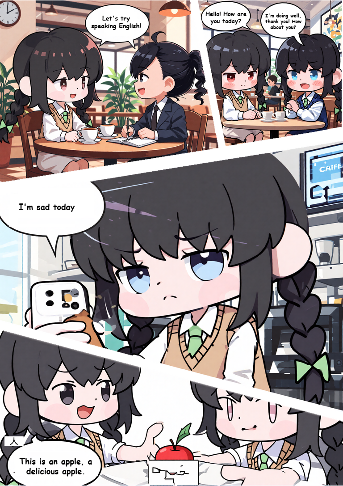
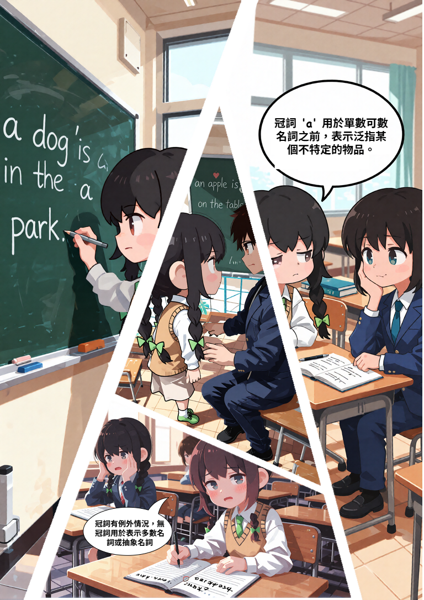
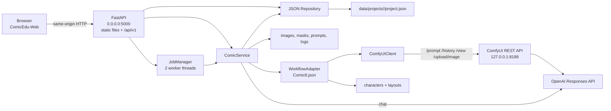
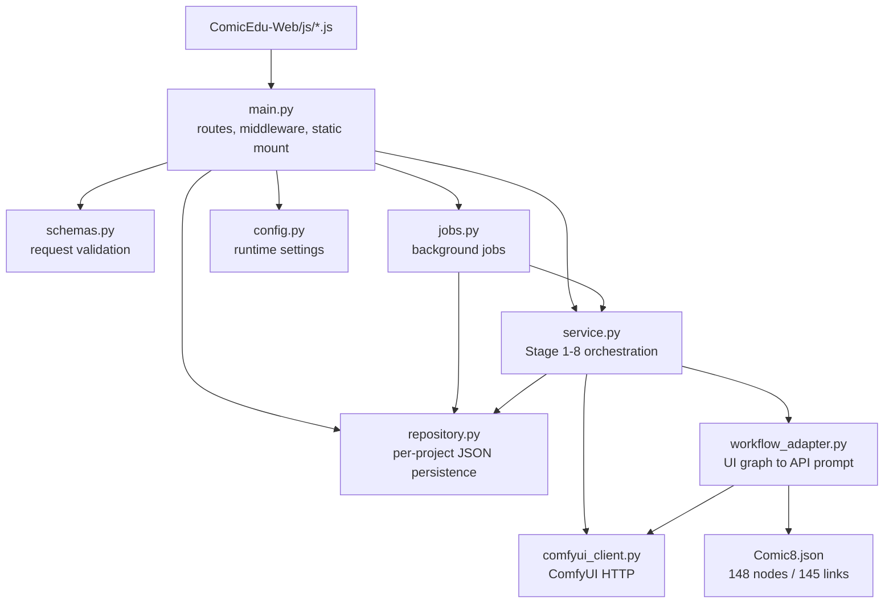
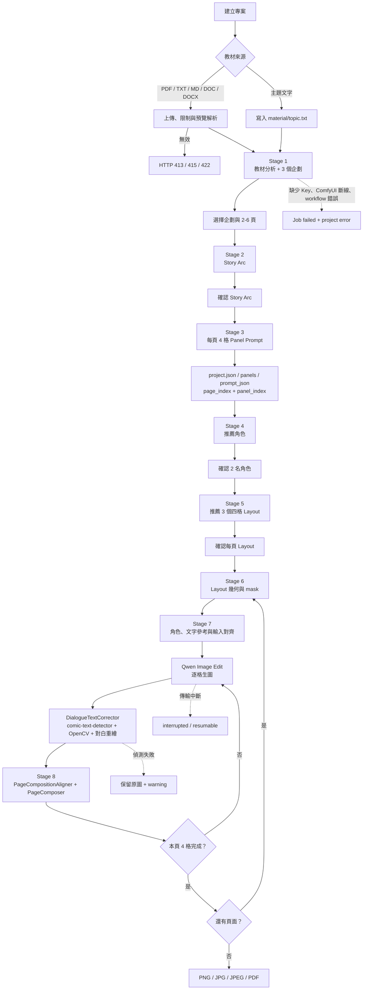

# 專案名稱：ComicEdu 教育漫畫生成系統

## 專案總覽（Project Overview）

ComicEdu 是將教材、教學主題與教學目標轉換成多頁四格教育漫畫的完整應用程式（app）。系統處理教材分析、企劃選擇、Story Arc、逐頁四格劇本、角色與版面推薦、圖像生成、對白文字校正、整頁合成與匯出。

專案解決的問題是將原始教材整理成可視覺化的知識敘事，並讓教師能在生圖前檢視與調整劇本、角色、版面、提示詞與對白。主要使用對象為教師與教材內容製作者。

系統包含純 HTML/CSS/JavaScript 前端、FastAPI Backend、每專案 JSON 持久化、OpenAI Responses API 整合、ComfyUI REST API 整合與 `Comic8.json` workflow。

## 成果展示（Showcase）

以下成果皆由 ComicEdu 教育漫畫生成流程製作。點擊圖片可在 GitHub 中查看原始尺寸。

### 教育漫畫主題

| 分數在生活中的應用 | 光合作用的奧祕 | 色彩魔法實驗室 |
|---|---|---|
| [](ComicEdu-Web/assets/showcase/分數在生活中的應用.png) | [](ComicEdu-Web/assets/showcase/光合作用的奧秘.png) | [](ComicEdu-Web/assets/showcase/色彩魔法實驗室.png) |

| 古文明的神祕訊息 | 城市裡的老故事 | 神話與傳說的祕密 |
|---|---|---|
| [](ComicEdu-Web/assets/showcase/古文明的神祕訊息.png) | [](ComicEdu-Web/assets/showcase/城市裡的老故事.png) | [](ComicEdu-Web/assets/showcase/神話與傳說的祕密.png) |

| 未來新聞編輯室 |
|---|
| [](ComicEdu-Web/assets/showcase/未來新聞編輯室.png) |

### 主題知識：自然

| 第 1 頁 | 第 2 頁 | 第 3 頁 | 第 4 頁 |
|---|---|---|---|
| [](ComicEdu-Web/assets/showcase/主題知識/自然/1-1.png) | [](ComicEdu-Web/assets/showcase/主題知識/自然/1-2.png) | [](ComicEdu-Web/assets/showcase/主題知識/自然/1-3.png) | [](ComicEdu-Web/assets/showcase/主題知識/自然/1-4.png) |

### 主題知識：社會

| 第 1 頁 | 第 2 頁 | 第 3 頁 | 第 4 頁 |
|---|---|---|---|
| [](ComicEdu-Web/assets/showcase/主題知識/社會/1.png) | [](ComicEdu-Web/assets/showcase/主題知識/社會/2.png) | [](ComicEdu-Web/assets/showcase/主題知識/社會/3.png) | [](ComicEdu-Web/assets/showcase/主題知識/社會/4.png) |

### 主題知識：英文

| 第 1 頁 | 第 2 頁 | 第 3 頁 | 第 4 頁 |
|---|---|---|---|
| [](ComicEdu-Web/assets/showcase/主題知識/英文/1.png) | [](ComicEdu-Web/assets/showcase/主題知識/英文/2.png) | [](ComicEdu-Web/assets/showcase/主題知識/英文/3.png) | [](ComicEdu-Web/assets/showcase/主題知識/英文/4.png) |

## 第一次安裝：最短路徑

完成一次可用安裝需要約 20 分鐘（不含約 40 GB 模型下載時間）。請依序完成：

1. 安裝最新版 ComfyUI，至少要能載入 Qwen Image Edit 2511 的核心節點。
2. 安裝本 README「安裝 ComfyUI 外部節點」列出的 3 個外部節點套件與完整 `GK_comic` 自製節點套件。
3. 依「模型清單與放置位置」下載 4 個 Qwen 模型檔，檔名及目錄必須與表格完全一致。
4. 修改根目錄 `config.py`，至少設定 `OPENAI_API_KEY`、`COMFYUI_INPUT_DIR` 與需要的網路參數。
5. 啟動 ComfyUI，再啟動 `server.py`，最後執行健康檢查。

> [!IMPORTANT]
> `Comic8_api.json` 是 Backend 預設執行的 API-format workflow；`Comic8.json` 是供 ComfyUI 介面檢視與編輯的 UI-format workflow。修改 UI workflow 後，必須重新匯出 API format，否則網頁仍會執行舊的 `Comic8_api.json`。

## 系統架構說明（Architecture Overview）

同一個 FastAPI 進程同時提供 `ComicEdu-Web/` 靜態檔案與 `/api/v1` API。正式部署時，GitHub Pages 前端透過集中設定的 Backend Base URL 呼叫 FastAPI；前端不直接呼叫 OpenAI 或 ComfyUI，也不儲存 API Key。

## Ubuntu + GitHub Pages Deployment

1. 複製整個專案到 Ubuntu，以環境變數或根目錄 `config.py` 設定 `OPENAI_API_KEY`、`COMFYUI_INPUT_DIR`、`GK_COMIC_DATA_DIR`、`HOST=0.0.0.0`、`PORT=5000`、`FRONTEND_ORIGIN`、`CORS_ALLOWED_ORIGINS`、`SESSION_COOKIE_SECURE` 與 `SESSION_COOKIE_SAMESITE`。專案目前沒有 `.env.example`。
2. 在 `Comic8.json` 及相關 workflow widget 修改 Ubuntu 實際的 `characters.json`、`characters_root`、`layouts.json`、`layouts_root`、material 與其他檔案路徑；啟動 Backend 時會列出 Windows absolute path 與不存在路徑警告，但不會因此停止。
3. 在 `ComicEdu-Web/js/config.js` 只修改 `BACKEND_BASE_URL`，例如 `https://ailab.ntcu.edu.tw:6006`。所有 API、圖片與下載資源會使用這個共用設定，並保留本機同源除錯模式。
4. 啟動 ComfyUI 後執行 `python server.py`。Backend 預設監聽 `0.0.0.0:5000`，ComfyUI 預設只使用 `http://127.0.0.1:8188`。

GitHub Pages 必須使用 HTTPS，正式 Backend URL 也必須提供有效 HTTPS。Port Forwarding、TLS、DNS 與外部網路設定由部署環境處理，本專案不會自動設定。

Backend 透過 ComfyUI HTTP API 上傳輸入、提交 prompt、輪詢 history 並下載 output。ComfyUI 連線沒有使用 WebSocket。Stage 1-5 的 OpenAI 呼叫封裝在 ComfyUI workflow 節點中；`/api/v1/chat` 則由 Backend 直接呼叫 OpenAI Responses API。

`WorkflowAdapter` 會在建立 executable API prompt 前解析 KJNodes 的 UI-only `SetNode`／`GetNode`：依 pair name 與 workflow links 將每個 Get downstream 重接至對應 Set 的真正 upstream source，保留 output slot，最後排除所有 Set/Get。原始 `Comic8.json` 不會被修改，也不要求 `SetNode`／`GetNode` 出現在 ComfyUI `/object_info`。

Backend 預設以專案根目錄的 API-format `Comic8_api.json` 作為 workflow 權威來源，直接裁切 Stage dependency、套用 runtime overrides 並提交 executable prompt，不再進行 Set/Get 轉換。`COMFYUI_WORKFLOW_PATH` 可指定其他本機 workflow；UI-format resolver 僅保留向後相容。



模組職責與依賴關係：



## 系統流程說明（System Flow）

主要使用流程對應五個前端頁面與八個 Backend／ComfyUI Stage。HTTP middleware 會依 `completedStep` 阻擋跳至尚未可用的後續頁面；檢視已完成的較早階段時，前端會進入唯讀模式。



關鍵處理規則：

1. Stage 3 每頁固定產生四格，完整 Panel Prompt 立即寫入該專案 `project.json` 內的 `pages[].panels[].prompt_json`。
2. 每次生成還會將當次 Prompt 快照寫入 `rev_<n>/prompts/panel_<n>.json`。
3. `DialogueTextCorrector` 以 Stage 3 `文字內容` 為正確文字來源；OCR 只用於 debug 與原文字檢查，不決定是否替換。
4. `comic-text-detector` 先找文字 bbox／mask，再由文字群組反推主要淺色對話框；預設文字偵測 threshold 為 `0.50`，找不到完整框時改用安全清除區域。
5. 逐格完成後重新執行 Stage 8 並寫入 `preview_partial.png`；全頁完成後寫入 final image。

背景任務使用最多兩條 worker thread。Backend 重啟後，處於 `queued` 或 `running` 的生成任務會轉為 `interrupted`，已存在的 Panel 圖片與 mask 可被後續生成重用。

## 資料夾結構說明（Folder Structure）

```text
ComfyUI/
├── server.py
├── config.py
├── requirements.txt
├── Comic8.json
├── backend/app/
│   ├── main.py
│   ├── config.py
│   ├── schemas.py
│   ├── repository.py
│   ├── jobs.py
│   ├── service.py
│   ├── workflow_adapter.py
│   └── comfyui_client.py
├── ComicEdu-Web/
│   ├── index.html
│   ├── Portal.html
│   ├── Projects.html
│   ├── 1_劇本構思.html ... 5_匯出分享.html
│   ├── js/
│   ├── css/
│   ├── assets/
│   ├── vendor/
│   └── .git/
├── file/
│   ├── characters/characters.json
│   ├── characters/characters/1.png ... 5.png
│   ├── layouts/layouts.json
│   └── layouts/layouts/layout_01.png ... layout_56.png
├── data/
│   └── projects/
├── tools/update_dialogue_workflow.py
├── .venv/
└── __pycache__/
```

- `backend/app/`：Backend API、業務流程、JSON Repository 與 ComfyUI 整合。
- `ComicEdu-Web/`：瀏覽器直接載入的前端，沒有 npm build 步驟。`vendor/` 收錄 Tailwind runtime 與 Material Symbols，`assets/` 收錄 10 張 UI JPG。
- `file/characters/`：5 名角色的 metadata 與 PNG 參考圖。
- `file/layouts/`：Layout metadata 與 56 張 PNG。程式只提供 `layouts.json` 中 `panel_count == 4` 的 16 種版面。
- `data/projects/`：每個 `prj_*` 專案各自保存可直接閱讀的 `project.json`，並在同一專案目錄保存教材、Prompt log、mask、Panel、debug input、revision 與最終圖片。
- `tools/`：將 `DialogueTextCorrector` 及連線同步至指定 workflow 的工具。
- `.venv/`、`__pycache__/`：本機 Python 執行環境與緩存。
- `ComicEdu-Web/.git/`：前端目錄的 Git metadata，不參與執行期流程。

生成專案的主要檔案結構：

```text
data/projects/prj_<id>/
├── project.json
├── material/
├── prompt_logs/
└── page_<n>/
    ├── base.png
    ├── preview_partial.png
    ├── layout_masks/<layout>/geometry.json
    ├── debug_inputs/panel_<n>/rev_<n>/
    └── rev_<n>/
        ├── prompts/panel_<n>.json
        ├── panels/
        ├── masks/
        ├── stage8/
        └── final/
```

`project.json` 可直接以文字編輯器檢視，頂層結構為：

```json
{
  "schema_version": 1,
  "project": {
    "project_id": "prj_<id>",
    "owner_id": "usr_<id>",
    "status": "initialized"
  },
  "pages": [
    {
      "page_index": 1,
      "panels": [
        {
          "panel_index": 1,
          "prompt_json": {},
          "generated_image": null
        }
      ]
    }
  ],
  "jobs": [],
  "assets": []
}
```

Repository 寫入時會先建立同目錄 temporary file，再以 `os.replace()` 取代 `project.json`。若要手動修改 JSON，應先停止 Backend，避免手動變更被進程中的寫入覆蓋。

## 核心模組與重要檔案（Key Modules & Files）

| 檔案 | 功能職責 | 關聯 |
|---|---|---|
| `server.py` | 套用本機設定並以 Uvicorn 啟動 FastAPI。 | `config.py`、`backend.app.main` |
| `config.py` | Backend Secret、ComfyUI、data、upload limit、host 與 port 入口。 | `backend/app/config.py` |
| `backend/app/main.py` | API routes、Session middleware、階段導航、上傳、匯出、SSE 與 StaticFiles。 | 全部 Backend 模組 |
| `backend/app/config.py` | 從環境變數建立 immutable `Settings`。 | `service.py` |
| `backend/app/schemas.py` | Pydantic request model，限制頁數 2-6、每頁四格與兩名角色。 | `main.py` |
| `backend/app/repository.py` | 以 temporary file 與 atomic replace 讀寫每專案 JSON，處理 CRUD、Session 隔離、Prompt、Job 與 Asset。 | `data/projects/prj_<id>/project.json` |
| `backend/app/jobs.py` | 兩條 worker thread 執行背景工作並記錄結果。 | Repository、Service |
| `backend/app/service.py` | Stage 1-8 編排、Prompt log、逐格生成、重生、合成與 debug asset。 | Adapter、Client、Repository |
| `backend/app/workflow_adapter.py` | 將 UI workflow 節點轉成 ComfyUI API prompt graph。 | `Comic8.json`、`/object_info` |
| `backend/app/comfyui_client.py` | Workflow、object info、upload、prompt、history 與 output HTTP 封裝。 | ComfyUI REST API |
| `Comic8.json` | Stage 1-8 與對白校正 workflow，共 148 nodes、145 links。 | WorkflowAdapter、GK custom nodes |
| `ComicEdu-Web/js/config.js` | `API_BASE`、asset URL、階段鎖定與唯讀模式。 | 所有前端頁面 |
| `step1_script.js` | 教材、企劃、Story Arc、劇本編輯與 AI 助手。 | material、script、chat API |
| `step2_character.js` | 角色清單、AI 推薦與兩名角色選擇。 | character API |
| `step3_storyboard.js` | 逐頁 Layout 推薦、預覽與選擇。 | layout API |
| `step4_generation.js` | 生成輪詢、Panel hit test、Prompt 編輯、單格重生與預覽。 | panel、mask、preview API |
| `step5_export.js` | 預覽與 PNG、JPG、JPEG、PDF 下載。 | export API |
| `tools/update_dialogue_workflow.py` | 建立／更新 node 302 並將校正後圖片接至整頁合成。 | `Comic8.json` |
| `tools/sync_dialogue_text_corrector.py` | 備份並同步新版節點、字型與模型到目前 ComfyUI。 | `comfyui_nodes/GK_comic/` |

## ComfyUI 節點清單

`Comic8.json` 有 148 個 UI 節點與 145 條連線；Backend 實際送出的 `Comic8_api.json` 有 73 個執行節點、48 種 class type。以下是完整依賴來源。

### 外部節點套件

| 套件 | 此 workflow 使用的節點 | 安裝來源 | 是否必要 |
|---|---|---|---|
| ComfyUI 核心／`comfy_extras` | `UNETLoader`、`CLIPLoader`、`VAELoader`、`LoraLoaderModelOnly`、`TextEncodeQwenImageEditPlus`、`ModelSamplingAuraFlow`、`CFGNorm`、`KSampler`、`VAEEncode`、`VAEDecode`、`SetLatentNoiseMask`、`ImageScaleToTotalPixels`、`EmptyImage`、`PrimitiveInt`、`PreviewAny`、`PreviewImage`、`MaskPreview`、`SaveImage`、`StringFormat` | [ComfyUI](https://github.com/Comfy-Org/ComfyUI) | 必要；`TextEncodeQwenImageEditPlus` 需要近期版本 |
| ComfyUI-KJNodes | UI workflow 的 34 個 `SetNode`、41 個 `GetNode`，以及 `PathchSageAttentionKJ` | [kijai/ComfyUI-KJNodes](https://github.com/kijai/ComfyUI-KJNodes) | 必要；API workflow 已排除 Set/Get，但仍使用 SageAttention 節點 |
| ComfyUI Impact Pack | `ImpactDilateMask` | [ltdrdata/ComfyUI-Impact-Pack](https://github.com/ltdrdata/ComfyUI-Impact-Pack) | 必要 |
| comfyui-panels | `bmad_BuildLayoutPanels`、`bmad_PolygonBounds`、`bmad_PolygonToResizedMask`、`bmad_CropImageByBBox`、`bmad_CropMaskByBBox`、`bmad_CanvasPanel` | [bmad4ever/comfyui_panels](https://github.com/bmad4ever/comfyui_panels) | 必要 |

`PreviewAny`、`StringFormat` 與 Qwen Image Edit 編碼節點現在屬於 ComfyUI 核心／`comfy_extras`，不用另裝同名第三方套件。若載入 workflow 時顯示這些核心節點遺失，先更新 ComfyUI 並重新啟動。

### 自製 `GK_comic` 節點

| 階段 | class type | 用途 |
|---|---|---|
| 共用 | `OpenAIResponsesAPI`、`JSONArraySplitter`、`JSONListInspector` | 呼叫 OpenAI Responses API、拆分及檢查 JSON |
| Stage 1 | `MaterialFileLoader`、`MaterialAnalysisPromptBuilder`、`MaterialAnalysisResultParser` | 讀取教材、建立分析 prompt、解析企劃結果 |
| Stage 2 | `StoryArcPromptBuilder`、`StoryArcResultParser` | 建立並解析多頁 Story Arc |
| Stage 3 | `PageScriptPromptBuilder` | 產生每頁固定四格的腳本與生圖提示詞 |
| Stage 4 | `CharacterRecommendationPromptBuilder`、`CharacterRecommendationParser` | 推薦並解析兩名角色 |
| Stage 5 | `LayoutRecommendationPromptBuilder`、`LayoutRecommendationParser` | 推薦四格版面 |
| Stage 6 | `PanelLayoutLoader` | 載入 Layout、底圖與 polygon 資料 |
| Stage 7 | `CharacterReferenceMerger`、`CharacterReferenceSideRandomizer`、`PanelGenerationInputAligner`、`TextReferenceImageGenerator` | 整理角色參考圖、提示詞與對白參考圖 |
| Stage 8／後處理 | `DialogueTextCorrector`、`PageCompositionAligner`、`PageComposer` | 偵測並重繪對白、對齊 Panel、合成整頁 |

完整套件必須位於：

```text
<COMFYUI_ROOT>/custom_nodes/GK_comic/
├── __init__.py
├── align_panel_generation_inputs.py
├── analyze_material.py
├── call_openai_responses_api.py
├── dialogue_text_corrector.py
├── extract_material_tfidf.py
├── inspect_json_list.py
├── load_material_file.py
├── load_panel_layout.py
├── merge_character_references.py
├── page_composer.py
├── page_composition_aligner.py
├── PageScriptPromptBuilder.py
├── parse_material_analysis.py
├── parse_story_arc.py
├── randomize_character_sides.py
├── recommend_characters.py
├── recommend_page_layouts.py
├── render_text_reference_images.py
├── split_json_array.py
├── story_arc.py
├── requirements.txt
├── fonts/jf-openhuninn-2.0.ttf
└── models/
    ├── comictextdetector.pt
    └── comic-text-detector/
```

> [!WARNING]
> 本專案的 `comfyui_nodes/GK_comic/` 目前只包含 `DialogueTextCorrector` 的更新檔、字型與 detector，不是完整 `GK_comic` 套件。第一次安裝者必須先向專案維護者取得上表的完整套件；`tools/sync_dialogue_text_corrector.py` 只能更新既有完整套件，無法從零建立全部節點。

`DialogueTextCorrector` 以 [dmMaze/comic-text-detector](https://github.com/dmMaze/comic-text-detector) 的 `comictextdetector.pt` 偵測文字區域，使用 OpenCV 清除錯字，再以 `jf-openhuninn-2.0.ttf` 重繪 Stage 3 的正確繁體中文。找不到有效對話框時會保留原圖並輸出 warning。

## 模型清單與放置位置

`Comic8_api.json` 目前引用以下精確檔名。下載後放入對應目錄，接著重啟 ComfyUI；不要只放在任意子目錄後假設 workflow 會自動找到。

| 類型 | workflow 指定檔名 | 放置位置 | 下載來源 |
|---|---|---|---|
| Diffusion model | `qwen_image_edit_2511_bf16.safetensors` | `ComfyUI/models/diffusion_models/` | [Comfy-Org/Qwen-Image-Edit_ComfyUI](https://huggingface.co/Comfy-Org/Qwen-Image-Edit_ComfyUI/blob/main/split_files/diffusion_models/qwen_image_edit_2511_bf16.safetensors) |
| Text encoder | `qwen_2.5_vl_7b.safetensors` | `ComfyUI/models/text_encoders/` | [Comfy-Org/Qwen-Image_ComfyUI](https://huggingface.co/Comfy-Org/Qwen-Image_ComfyUI/blob/main/split_files/text_encoders/qwen_2.5_vl_7b.safetensors) |
| VAE | `qwen_image_vae.safetensors` | `ComfyUI/models/vae/` | [Comfy-Org/Qwen-Image_ComfyUI](https://huggingface.co/Comfy-Org/Qwen-Image_ComfyUI/blob/main/split_files/vae/qwen_image_vae.safetensors) |
| Lightning LoRA | `Qwen-Image-Edit-2511-Lightning-4steps-V1.0-fp32.safetensors` | `ComfyUI/models/loras/` | [lightx2v/Qwen-Image-Edit-2511-Lightning](https://huggingface.co/lightx2v/Qwen-Image-Edit-2511-Lightning/blob/main/Qwen-Image-Edit-2511-Lightning-4steps-V1.0-fp32.safetensors) |
| 文字偵測模型 | `comictextdetector.pt` | `ComfyUI/custom_nodes/GK_comic/models/` | 隨內部 `GK_comic` 發行包提供；上游程式為 [dmMaze/comic-text-detector](https://github.com/dmMaze/comic-text-detector) |
| OCR 模型 | EasyOCR `ch_tra` + `en` | 預設快取於使用者目錄的 `.EasyOCR/model/` | `DialogueTextCorrector` 第一次執行時由 EasyOCR 自動下載；離線主機需預先建立快取 |
| 雲端文字模型 | `gpt-4o` | 不需本機檔案 | Stage 1–5 的 5 個 `OpenAIResponsesAPI` 節點與 Backend AI 助手；需要有效 `OPENAI_API_KEY` 及可連線 OpenAI API |

官方 Qwen 2511 安裝與替代的 FP8 encoder／BF16 LoRA 可參考 [ComfyUI Qwen-Image-Edit-2511 指南](https://docs.comfy.org/tutorials/image/qwen/qwen-image-edit-2511)。若改用 FP8 encoder 或 BF16 LoRA，必須同時在 `Comic8.json` 與 `Comic8_api.json` 的 loader input 改成實際檔名；只改硬碟檔名不夠。

### 模型與節點硬體注意事項

- BF16 diffusion model 約 20 GB、FP16 text encoder 約 16.6 GB，另加 VAE、LoRA 與執行期顯存；低顯存主機應改用官方支援的量化版本並同步修改兩份 workflow。
- `PathchSageAttentionKJ` 目前設定為 `sageattn_qk_int8_pv_fp16_cuda`，ComfyUI 的 Python 環境必須能 `import sageattention`，且 wheel 必須符合 CUDA、PyTorch 與 GPU 架構。
- 若 SageAttention 不相容，可先在兩份 workflow 將該節點 bypass／移除，改接 loader model 至下游；速度會下降，但可用於確認其他安裝是否正確。

## 安裝與環境需求（Installation & Requirements）

Backend 與 ComfyUI 使用不同 Python 環境。所有 custom node 套件必須安裝到「ComfyUI 自己的 Python」，不可只裝進 Backend 的 `.venv`。

### 1. 安裝 Backend

```powershell
cd "<PROJECT_ROOT>"
python -m venv .venv
.\.venv\Scripts\Activate.ps1
python -m pip install --upgrade pip
python -m pip install -r requirements.txt
```

Linux：

```bash
cd /path/to/project
python3 -m venv .venv
source .venv/bin/activate
python -m pip install --upgrade pip
python -m pip install -r requirements.txt
```

### 2. 安裝 ComfyUI 外部節點

建議在 ComfyUI Manager 搜尋並安裝：`ComfyUI-KJNodes`、`ComfyUI Impact Pack`、`comfyui-panels`。安裝完必須重新啟動 ComfyUI。

手動安裝：

```powershell
cd "<COMFYUI_ROOT>\custom_nodes"
git clone https://github.com/kijai/ComfyUI-KJNodes.git
git clone https://github.com/ltdrdata/ComfyUI-Impact-Pack.git comfyui-impact-pack
git clone https://github.com/bmad4ever/comfyui_panels.git

& "<COMFYUI_PYTHON>" -m pip install -r .\ComfyUI-KJNodes\requirements.txt
& "<COMFYUI_PYTHON>" -m pip install -r .\comfyui-impact-pack\requirements.txt
& "<COMFYUI_PYTHON>" .\comfyui-impact-pack\install.py
& "<COMFYUI_PYTHON>" -m pip install -r .\comfyui_panels\requirements.txt
```

`<COMFYUI_PYTHON>` 範例：ComfyUI Desktop 常見為 `standalone-env\python.exe`；Windows Portable 常見為 `python_embeded\python.exe`；venv 安裝則是該 venv 的 `Scripts\python.exe`。請以實際安裝位置為準。

### 3. 安裝完整 GK_comic

1. 將維護者提供的完整 `GK_comic` 資料夾複製到 `<COMFYUI_ROOT>/custom_nodes/GK_comic`。
2. 用 ComfyUI 的 Python 安裝依賴：

```powershell
& "<COMFYUI_PYTHON>" -m pip install -r "<COMFYUI_ROOT>\custom_nodes\GK_comic\requirements.txt"
```

3. 確認 `fonts/jf-openhuninn-2.0.ttf`、`models/comictextdetector.pt` 和 `models/comic-text-detector/inference.py` 存在。
4. 若要套用本專案內最新版對白校正器，執行下列命令。工具會先備份舊檔；非預設路徑必須傳入 target：

```powershell
.\.venv\Scripts\python.exe tools\sync_dialogue_text_corrector.py "<COMFYUI_ROOT>\custom_nodes\GK_comic"
```

### 4. 放置 workflow

- Backend 已直接讀取專案根目錄的 `Comic8_api.json`，不需另複製到 ComfyUI userdata。
- 若要在 ComfyUI 圖形介面查看，將 `Comic8.json` 拖進 ComfyUI。
- 打開 UI workflow 後，修改 node `173`、`175`、`186`、`188` 的角色／Layout 絕對路徑，以及 node `227` 的測試教材路徑。
- 重新從 ComfyUI 匯出 API format 時，以匯出結果更新專案根目錄 `Comic8_api.json`，並保留 Backend 需要的固定 node ID。

### 5. 設定 Backend

| 變數 | 預設值 | 用途 |
|---|---|---|
| `OPENAI_API_KEY` | 空字串 | Backend Chat API 及 workflow 的 OpenAI 呼叫所需；不可提交真實 Key。 |
| `COMFYUI_URL` | `http://127.0.0.1:8188` | ComfyUI Base URL。 |
| `COMFYUI_WORKFLOW_PATH` | `Comic8_api.json` | Backend 實際提交的 API-format workflow。 |
| `COMFYUI_WORKFLOW_NAME` | `Comic8.json` | UI-format workflow 名稱，主要供相容及診斷。 |
| `COMFYUI_INPUT_DIR` | 空字串 | ComfyUI `input` 實體目錄；本機生圖前應設定。 |
| `GK_COMIC_DATA_DIR` | `<project>/data` | 專案 JSON 與生成圖片根目錄。 |
| `GK_UPLOAD_LIMIT_MB` | `25` | 教材上傳上限，單位 MB。 |
| `HOST` / `PORT` | `0.0.0.0` / `5000` | Backend 監聽位址。 |
| `FRONTEND_ORIGIN` / `CORS_ALLOWED_ORIGINS` | 空字串 | 跨 Origin 部署時允許的前端來源，逗號分隔。 |
| `SESSION_COOKIE_SECURE` / `SESSION_COOKIE_SAMESITE` | `false` / `lax` | HTTPS 與跨站 Cookie 設定。 |

## 使用方式（How to Use）

1. 在根目錄 `config.py` 設定 `OPENAI_API_KEY`、`COMFYUI_URL`、`COMFYUI_WORKFLOW_PATH` 與 `COMFYUI_INPUT_DIR`。
2. 啟動 ComfyUI，載入 `Comic8.json` 並確認畫面沒有紅色 missing node；再檢查 loader 下拉選單都能選到模型表中的檔案。
3. 啟動 Backend：

```powershell
.\.venv\Scripts\python.exe server.py
```

4. 在另一個 PowerShell 檢查狀態：

```powershell
Invoke-RestMethod http://127.0.0.1:5000/api/v1/health
```

5. 開啟 `http://127.0.0.1:5000/Portal.html`。目前 `AUTO_OPEN_BROWSER = False`，因此不會自動開啟瀏覽器。

健康檢查應確認 `backend == "ok"`、`openai_configured == true`、`comfyui.connected == true`、`comfyui.workflow_configured == true` 與 `comfyui.dialogue_text_corrector_loaded == true`。

基本操作：

1. 新增專案，輸入主題或上傳教材。
2. 選擇企劃，檢視並確認 Story Arc 與逐頁四格劇本。
3. 選擇兩名角色，再為每頁選擇四格 Layout。
4. 開始逐格生成；可編輯 Panel prompt、對白與 seed，並單格重生。
5. 於匯出頁下載 PNG、JPG、JPEG 或 PDF。多張點陣圖以 ZIP 傳回，PDF 為單一檔案。

## 設定說明（Configuration）

根目錄 `config.py` 是本機設定入口。`config.apply()` 使用 `os.environ.setdefault()`，因此進程已存在的同名環境變數優先於檔案值。設定只在 Python 啟動時讀取，修改後需重啟 Backend。

```python
OPENAI_API_KEY = "<backend-secret>"
COMFYUI_URL = "http://127.0.0.1:8188"
COMFYUI_WORKFLOW_NAME = "Comic8.json"
COMFYUI_WORKFLOW_PATH = "Comic8_api.json"
COMFYUI_INPUT_DIR = r"D:\ComfyUI\ComfyUI\ComfyUI\input"
GK_COMIC_DATA_DIR = ""
GK_UPLOAD_LIMIT_MB = 25
HOST = "0.0.0.0"
PORT = 5000
AUTO_OPEN_BROWSER = False
FRONTEND_PATH = "/Portal.html"
```

| 位置 | 設定 | 影響 |
|---|---|---|
| `ComicEdu-Web/js/config.js` | `API_BASE = '/api/v1'` | 前端 API 與圖片使用同 Origin 路徑。 |
| 根目錄 `config.py` | `AUTO_OPEN_BROWSER` / `FRONTEND_PATH` | 控制是否自動開啟瀏覽器與開啟的前端路徑。 |
| `backend/app/jobs.py` | `max_workers=2` | 同時執行背景 Job 數。 |
| `backend/app/service.py` | `PAGE_SIZE = (768, 1086)` | Layout mask 與 geometry canvas。 |
| `backend/app/service.py` | `LAYOUT_MASK_VERSION = "3-stage8"` | Layout geometry cache 版本。 |
| `Comic8.json` node 302 | `[0.50, 0.05, 0.05]` | comic-text-detector threshold；後兩值僅保留舊 workflow 介面相容。 |
| `file/characters/characters.json` | 角色 metadata | 角色列表、AI 推薦與圖片 mapping。 |
| `file/layouts/layouts.json` | Layout metadata | 版面篩選與 AI 推薦輸入。 |

Session Cookie 名稱為 `gk_user_session`，設定為 `HttpOnly=true`、`SameSite=Lax`、`Secure=false`、有效期一年。它用於隔離不同瀏覽器 Session 的專案，不是帳號登入。

Workflow 的角色 JSON、Layout JSON、角色圖片目錄與 Layout 圖片目錄來自節點 `173`、`175`、`186`、`188` 的 widget 值。`WorkflowAdapter` 讀取的是 ComfyUI userdata API 回傳的 `Comic8.json`。

## 開發者指南（Developer Guide）

建議閱讀順序：

1. `server.py`、根目錄 `config.py` 與 `backend/app/config.py`：執行入口與設定優先順序。
2. `backend/app/main.py`：API、Session、頁面關卡與靜態檔案服務。
3. `repository.py`、`schemas.py` 與 `jobs.py`：`project.json` 資料結構、驗證邊界與 Job 狀態。
4. `service.py`、`workflow_adapter.py`、`comfyui_client.py` 與 `Comic8.json`：Stage 1-8 與圖片輸出。
5. `ComicEdu-Web/js/config.js` 與五個 step script：各頁面 API 與輪詢條件。

修改注意事項：

- 前端新增 API 或圖片路徑時，沿用 `API_BASE` 與 `apiAssetUrl()`。
- 可延遲工作由 `queue()` 建立 Job，並透過 progress callback 寫回狀態。
- 每頁四格的假設同時存在於 Schema、Repository、Service、Frontend 與 workflow；改格數需同步所有層。
- Panel 提示詞、負向提示詞或對白被編輯時，`repository.update_panel()` 會同步更新 `prompt_json`。
- `WorkflowAdapter` 以固定節點 ID 建立 API prompt；更改 workflow node ID、input order 或 class type 後必須同步 adapter。

模組擴充建議：API payload 先在 `schemas.py` 定義；調整持久化格式時提升 `SCHEMA_VERSION` 並在 JSON Repository 加入明確轉換；ComfyUI Stage 在 Adapter 建立明確輸入連線並由 Service 驗證輸出；圖片 API 沿用 `checked_asset()` 的專案目錄邊界檢查。

不啟動生圖的靜態檢查：

```powershell
.\.venv\Scripts\python.exe -m compileall -q server.py config.py backend\app tools
.\.venv\Scripts\python.exe -c "from backend.app.main import app; print(app.title, app.version)"
.\.venv\Scripts\python.exe -m unittest discover -s tests -p "test_*.py" -v
```

`tests/test_json_repository.py` 涵蓋專案 JSON 建立、Repository 重載、Panel Prompt 同步、Job／Asset、中斷復原與 owner 隔離。CI workflow 目前尚未定義。

## 已知限制與待辦事項（Limitations & TODO）

- 沒有完整帳號、密碼、角色權限或身分驗證；專案以長效期 Session Cookie 與 `project.owner_id` 隔離。Session ID 本身不另外寫入中央資料檔。
- Cookie 預設為 `Secure=false`；HTTPS 部署必須設定 `SESSION_COOKIE_SECURE=true`，並依實際前端來源設定 CORS 與 SameSite。Reverse proxy、TLS 與 DNS 仍由部署環境處理。
- `config.py` 可從 `OPENAI_API_KEY` 環境變數讀取 Secret，不應將真實 Key 寫入 workflow 或提交至版本控制。專案目前沒有 `.env.example`。
- 專案內只附 `DialogueTextCorrector` 更新包，沒有完整 `GK_comic` 自製節點來源；對外發布前應補齊可安裝的完整節點套件或提供明確下載位置。
- Workflow 與 Adapter 依賴固定 node ID，workflow widget 也包含本機資產絕對路徑。移動專案或重建 workflow 後需同步調整。
- `file/layouts/layouts/` 有 56 張 PNG，`layouts.json` 只有 55 筆 metadata；`layout_16.png` 沒有 metadata，不會出現在可選 Layout 中。
- 上傳 API 允許 `.doc`，但非 PDF／DOCX 的預覽邏輯使用 UTF-8 解碼，二進位 DOC 可能因解碼失敗而回傳 422。掃描型 PDF 需先在系統外完成 OCR。
- 前端使用輪詢與 `/panels/wait`。Backend 雖有 `/api/v1/projects/{project_id}/events` SSE endpoint，前端沒有建立 `EventSource`；前後端均未使用 WebSocket。
- Job 執行於單一 Backend 進程的 ThreadPool，沒有外部 queue worker。進程停止時工作不會繼續，重啟後只能依已保存 Asset 接續。
- JSON Repository 使用單一 Backend 進程內的 `RLock` 與 temporary-file atomic replace；不支援多個 Backend 進程同時寫入同一份 `project.json`。
- `DialogueTextCorrector` 在找不到有效對話框、mapping 不一致或不可恢復錯誤時保留原圖，異常 Panel 可能保留生成模型的錯字。
- Python 支援版本政策、自動化測試、CI/CD、生產環境進程管理、備份還原、授權條款、瀏覽器支援矩陣與無障礙驗收：尚未定義。
- 原始碼中沒有找到明示的 `TODO`、`FIXME` 或 `NotImplementedError` 區塊。

## 補充說明（Notes）

- FastAPI 根路由會 redirect 至 `/Portal.html`，並在 API routes 之後將 `ComicEdu-Web/` mount 至 `/`。
- ComfyUI 整合使用 `/system_stats`、`/object_info`、`/api/userdata/<workflow>`、`/upload/image`、`/prompt`、`/history/<prompt_id>` 與 `/view`。
- 一般 workflow 等待上限為 900 秒；單格生成為 3600 秒；Stage 8 合成與 Layout geometry 為 300 秒；Backend AI 助手為 90 秒。
- Prompt log 儲存前會將 `api_key`、`authorization`、`password` 與 `token` 欄位改為 `[REDACTED]`。
- 圖片 endpoint 會檢查檔案必須位於該專案 data 目錄內；刪除專案時也會刪除對應專案目錄。
- `project.json` 頂層包含 `schema_version`、`project`、`pages`、`jobs` 與 `assets`。`pages[].panels[]` 保存每格提示詞、對白、seed、狀態、revision、圖片路徑與完整 `prompt_json`。
- `DialogueTextCorrector` 輸出連入 `PageCompositionAligner`，所以 Panel 儲存、逐格預覽與最終 `PageComposer` 都使用校正後圖片。
